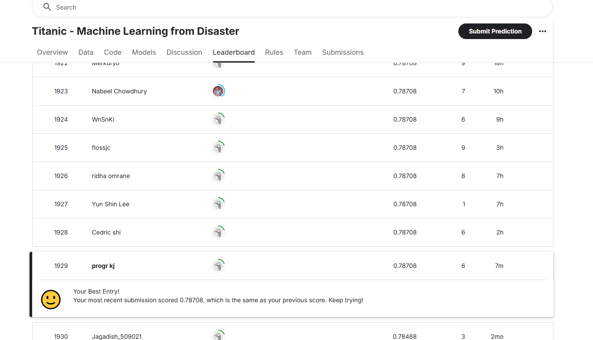

# First Assignment

## 문제1. Kaggle `Titanic - Machine Learning from Disaster`

> Data : [Kaggle - Titanic](https://www.kaggle.com/competitions/titanic) \
> Used model: [RandomForestClassifier](https://scikit-learn.org/stable/modules/generated/sklearn.ensemble.RandomForestClassifier.html)

- My Code
    [https://www.kaggle.com/code/progrkj/titanic-rf-classifier](https://www.kaggle.com/code/progrkj/titanic-rf-classifier)
- My Rank

---

## 문제2. 분류 연습문제

- [분류 연습문제 ipynb 보기](colab_practice/practice/index.html)